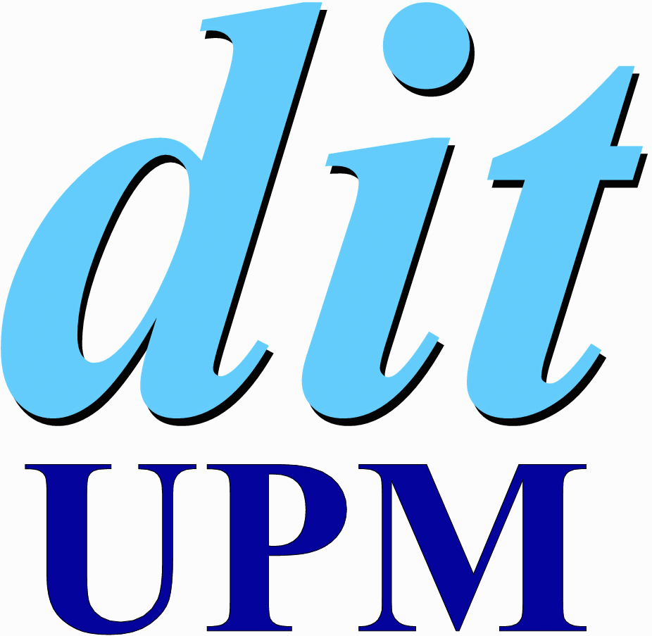

# Template Python Project 

Template for a Python app project.

---

Developed by the research group Sistemas de Tiempo Real y Arquitectura de
Sistemas Telemáticos (STRAST) part of Departamento de Ingeniería de Sistemas
Telemáticos (DIT) located in Escuela Técnica Superior de Ingenieros de
Telecomunicación (ETSIT) part of Universidad Politécnica de Madrid
department (UPM).

**Contact**
- gi.strast@upm.es
- [Web page](http://web.dit.upm.es/~str/)
- [GitHub](https://github.com/STRAST-UPM/)

